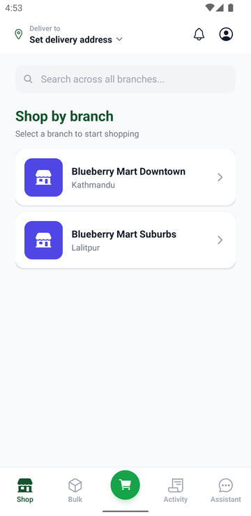
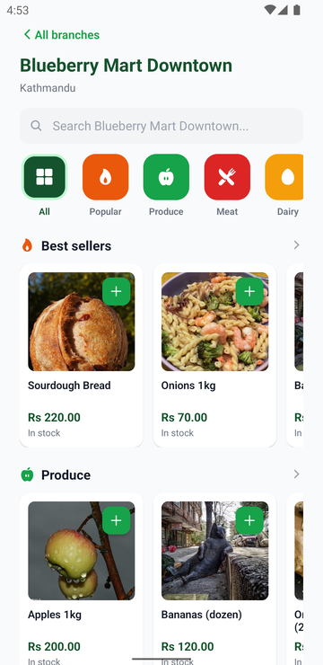
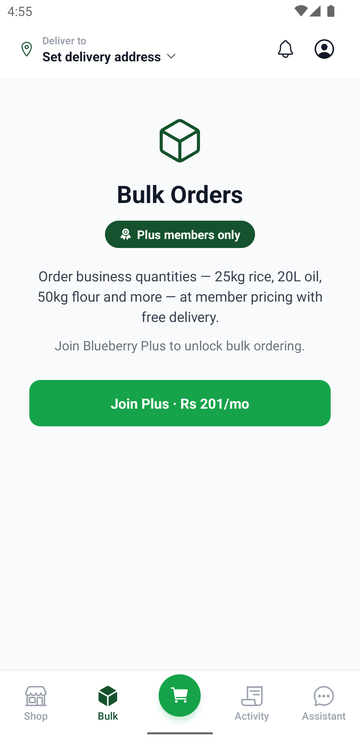
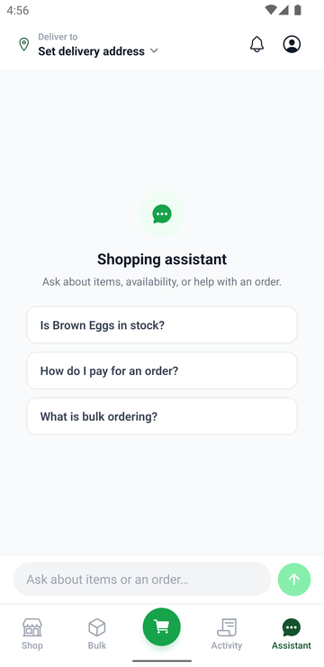
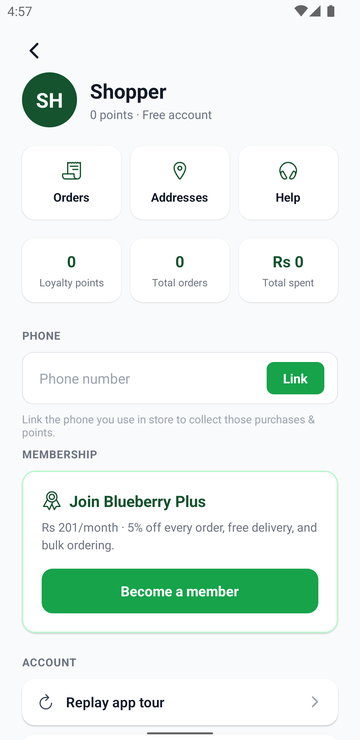
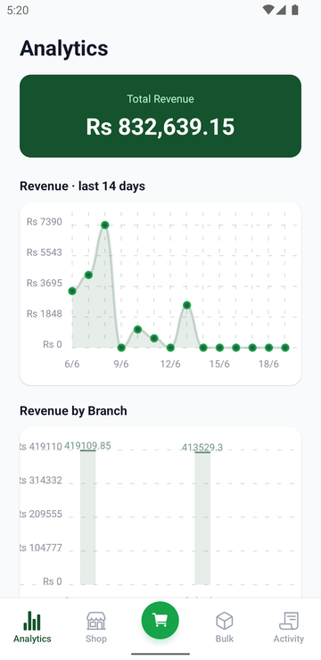
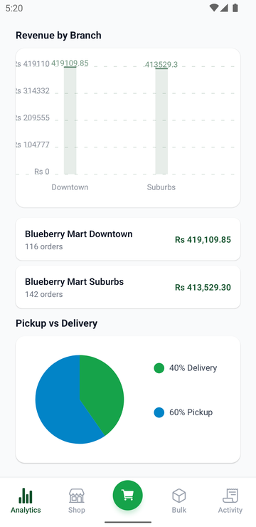
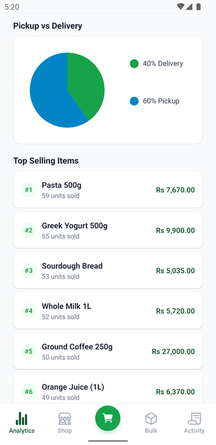

# 🫐 Blueberry Mart

A full-stack grocery retail platform built for multi-branch operations, serving both customers and shareholders through a role-based mobile and API experience. Designed to scale on **Google Cloud Platform** with real-time event streaming, intelligent caching, and analytical data warehousing.

---

## Why I built this

My dad is opening a grocery mart in Nepal, and I'm handling the digital infrastructure for it. So this isn't a CRUD demo — it's built around what a real multi-branch retailer actually needs: two very different users sharing one backend (customers shopping a branch, shareholders watching revenue across all branches), inventory that stays correct under concurrent orders, and analytics that don't slow down checkout. Those real constraints are what pushed the design toward event streaming (Kafka), a read cache (Redis), and a separate analytical warehouse (BigQuery) rather than a single database doing everything.

---

## Live Demo

| Resource | Link |
|---|---|
| **Admin portal** | [blueberrymart-admin.web.app](https://blueberrymart-admin.web.app) |
| **Mobile app (Android)** | Google Play — internal testing (request access) |
| **API (Swagger UI)** | `http://localhost:5027/swagger` — dev only (disabled in prod) |

---

## Table of Contents

- [Screenshots](#screenshots)
- [Overview](#overview)
- [Architecture](#architecture)
- [Design Decisions & Tradeoffs](#design-decisions--tradeoffs)
- [Tech Stack](#tech-stack)
- [Project Structure](#project-structure)
- [Local Development](#local-development)
- [Environment Variables](#environment-variables)
- [Database Migrations](#database-migrations)
- [API Endpoints](#api-endpoints)
- [Running Tests](#running-tests)
- [What I Learned](#what-i-learned)

---

## Screenshots

<p align="center"></p>

**Customer app**

| Shop by branch | Product catalog | Bulk orders (Plus) | AI assistant | Account & loyalty |
| --- | --- | --- | --- | --- |
|  |  |  |  |  |

**Shareholder analytics portal**

| Revenue dashboard | Revenue by branch | Top-selling items |
| --- | --- | --- |
|  |  |  |

---

## Overview

Blueberry Mart supports two user roles with distinct experiences:

| Role | Experience |
|---|---|
| **Customer** | Browse branch inventory, place pickup or delivery orders, submit photo reviews, earn loyalty points |
| **Shareholder** | Full inventory access across all branches, business analytics (revenue, top items, low-stock alerts) |

---

## Architecture

```
┌─────────────────────────────────────────────────────────────────────┐
│                        CLIENT LAYER                                 │
│                                                                     │
│          📱 Expo (React Native)  ──  iOS / Android / Web           │
└───────────────────────────┬─────────────────────────────────────────┘
                            │  HTTPS (JWT Bearer)
┌───────────────────────────▼─────────────────────────────────────────┐
│                      GCP — CLOUD RUN                                │
│                                                                     │
│              🟢 BlueberryMart.Api  (.NET 8 Web API)                │
│         ┌──────────────────────────────────────────┐               │
│         │  Auth │ Inventory │ Orders │ Reviews │    │               │
│         │       Shareholder Analytics              │               │
│         └──────────┬────────────────┬─────────────┘               │
└────────────────────┼────────────────┼─────────────────────────────┘
                     │                │
       ┌─────────────▼──┐    ┌────────▼──────────────────┐
       │  🔴 Redis       │    │  🐘 Cloud SQL (PostgreSQL) │
       │  (Memorystore)  │    │                           │
       │                 │    │  users                    │
       │  • Inventory    │    │  branches                 │
       │    lookups      │    │  inventory                │
       │  • Session      │    │  orders + order_items     │
       │    cache        │    │  reviews                  │
       └─────────────────┘    └───────────────────────────┘
                     │
       ┌─────────────▼───────────────────────────────────┐
       │          Apache Kafka  (Confluent Cloud)         │
       │                                                  │
       │  Topics:                                         │
       │  • order.placed   → deduct inventory             │
       │  • order.status   → notify customer              │
       │  • review.created → update item rating cache     │
       │  • stock.alert    → trigger restock workflow     │
       └──────────────────────┬───────────────────────────┘
                              │  Streaming ingest
       ┌──────────────────────▼───────────────────────────┐
       │              GCP — BigQuery                      │
       │                                                  │
       │  Datasets:                                       │
       │  • orders_stream      (real-time sales)          │
       │  • inventory_events   (stock movements)          │
       │  • user_activity      (loyalty & engagement)     │
       │                                                  │
       │  Powers:  Shareholder analytics dashboard        │
       │           Revenue reports · Demand forecasting   │
       └──────────────────────────────────────────────────┘
```

### How the layers interact

```
Customer places order
        │
        ▼
  API validates stock ──► Redis cache hit? ──► YES ──► skip DB read
        │                         │
        │                        NO
        │                         ▼
        │               Cloud SQL (source of truth)
        │
        ▼
  Order written to Cloud SQL
        │
        ▼
  Kafka event: order.placed
        │
        ├──► Consumer: deduct inventory → update Redis + Cloud SQL
        ├──► Consumer: stream event → BigQuery (orders_stream)
        └──► Consumer: send confirmation → push notification
```

---

## Design Decisions & Tradeoffs

A few choices I'd defend in a code review:

- **Kafka for order events instead of doing the work inline.** Placing an order only writes to Cloud SQL and emits `order.placed`; inventory deduction, BigQuery streaming, and notifications are independent consumers. A slow or failing consumer can't block checkout, and adding a new side effect (e.g., analytics) is a *new consumer*, not a change to the write path.
- **Redis in front of Cloud SQL, not as the source of truth.** Inventory lookups are read-heavy and hot, so they're cached; Cloud SQL stays authoritative. The tradeoff is cache-invalidation discipline — the `order.placed` consumer must keep Redis consistent after every stock change.
- **BigQuery separate from Postgres (OLAP vs OLTP).** Shareholder analytics (revenue over time, top items) are heavy aggregations that would compete with transactional writes if run on Cloud SQL. Streaming events into BigQuery keeps customer checkout fast and makes large aggregations cheap.
- **One role-based API over two services.** Customer and Shareholder access is enforced by JWT role claims on scoped endpoints (`/inventory/customer` vs `/inventory/shareholder`), so the data is segregated without the operational cost of two deployments — the right call for this scope.
- **At-least-once delivery → idempotent consumers.** Kafka can redeliver, so consumers are written to be idempotent (an order can't be double-deducted). This is covered explicitly in the test suite.
- **EF Core migrations auto-apply on startup.** Deploying new code is enough — no manual migration step. The tradeoff is that a bad migration ships with the deploy, which is acceptable given the migrations are tested in CI.

---

## Tech Stack

### Backend
| Layer | Technology |
|---|---|
| API | .NET 8 Web API (C#) |
| Auth | JWT Bearer — role-based (`Customer` / `Shareholder`) |
| ORM | Entity Framework Core 8 + Npgsql |
| Primary DB | PostgreSQL (Cloud SQL on GCP) |
| Cache | Redis (GCP Memorystore) |
| Message Broker | Apache Kafka (Confluent Cloud) |
| Analytics | Google BigQuery |
| Hosting | GCP Cloud Run (containerised, auto-scaling) |
| Storage | GCP Cloud Storage (review images) |

### Frontend
| Layer | Technology |
|---|---|
| Framework | Expo (React Native) — iOS, Android, Web |
| Navigation | React Navigation (Native Stack) |
| Auth Storage | Expo SecureStore (Keychain / Keystore) |
| HTTP | Fetch API |

### Infrastructure
| Concern | Tool |
|---|---|
| Container registry | GCP Artifact Registry |
| CI/CD | GitHub Actions → Cloud Run deploy |
| Secrets | GCP Secret Manager |
| Monitoring | GCP Cloud Logging + Cloud Monitoring |

---

## Local Development

### Prerequisites
- [.NET 8 SDK](https://dotnet.microsoft.com/download)
- [PostgreSQL 14+](https://www.postgresql.org/download/)
- [Node.js 18+](https://nodejs.org/) + npm
- [Expo CLI](https://docs.expo.dev/get-started/installation/)
- `psql` — install via `brew install libpq`

### Backend

```bash
# 1. Copy and fill in your local secrets
cp BlueberryMart.Api/appsettings.Development.example.json \
   BlueberryMart.Api/appsettings.Development.json

# 2. Run the API — EF Core migrations apply automatically on startup
dotnet run --project BlueberryMart.Api
# Swagger UI → http://localhost:5027/swagger
```

### Frontend

```bash
cd BlueberryMartApp
cp .env.example .env.local          # set EXPO_PUBLIC_API_URL
npm install
npx expo start
```

---

## Environment Variables

### Backend

Sensitive values are **never committed**. Set them in `appsettings.Development.json` locally, or as environment variables in production (double-underscore maps to colon in .NET).

| Variable | Description |
|---|---|
| `Jwt__Secret` | HMAC-SHA256 signing key — minimum 32 characters |
| `ConnectionStrings__DefaultConnection` | PostgreSQL connection string |

### Frontend

| Variable | Description |
|---|---|
| `EXPO_PUBLIC_API_URL` | Base URL of the .NET API (`http://localhost:5027` locally) |

---

## Database Migrations

Schema is managed by **EF Core migrations** (`BlueberryMart.Api/Migrations/`). Migrations are applied automatically when the API starts (`DbInitializer.Initialize` calls `context.Database.Migrate()`), so deploying new code is enough — no manual step needed.

To add a new migration after editing an entity:

```bash
dotnet dotnet-ef migrations add <Name> --project BlueberryMart.Api --output-dir Migrations
```

The raw SQL files in `Database/Migrations/` are kept for history only and are no longer the source of truth.

---

## API Endpoints

All endpoints except `/api/auth/login` require a `Bearer` token.

| Method | Path | Role | Description |
|---|---|---|---|
| `POST` | `/api/auth/login` | — | Returns a signed JWT |
| `GET` | `/api/inventory/customer?branchId=` | Customer | In-stock, non-bulk items for a branch |
| `GET` | `/api/inventory/shareholder` | Shareholder | Full inventory across all branches |
| `POST` | `/api/orders` | Customer | Place an order, deducts stock, credits loyalty points |
| `POST` | `/api/reviews` | Customer | Submit a text or photo review |
| `GET` | `/api/shareholders/analytics` | Shareholder | Revenue, top items, low-stock alerts |

---

## Running Tests

Integration tests run against a dedicated `blueberry_mart_test` PostgreSQL database that is created and torn down automatically.

```bash
dotnet test Tests/BlueberryMart.Api.Tests
```

**138 tests** covering auth, inventory access control, order validation, review submission, analytics, and idempotency.

---

## What I Learned

- **Designing the event flow first made features additive.** Once `order.placed` existed as an event, adding BigQuery streaming and push notifications was a matter of attaching consumers — no rewrites of the order path. Getting the seams right early paid off repeatedly.
- **Separating OLTP from OLAP is a real architectural lever.** Moving analytical queries off Cloud SQL into BigQuery is what kept customer checkout fast while shareholders run heavy aggregations — I now reach for that split deliberately instead of bolting reporting onto the transactional DB.
- **A cache is only a win with invalidation discipline.** Redis sped up inventory reads, but the value depended entirely on the consumer keeping it consistent with Cloud SQL after every order — caching is as much about invalidation as about speed.
- **At-least-once delivery forces you to think in idempotency.** Kafka redelivering a message would have double-deducted stock if consumers weren't idempotent; building (and testing) that in up front avoided a whole class of data-correctness bugs.
